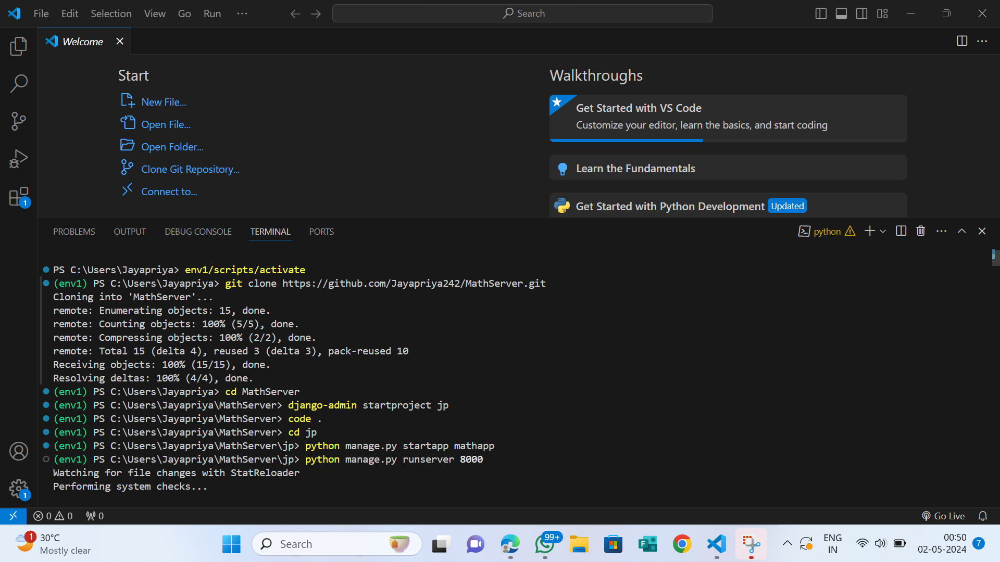
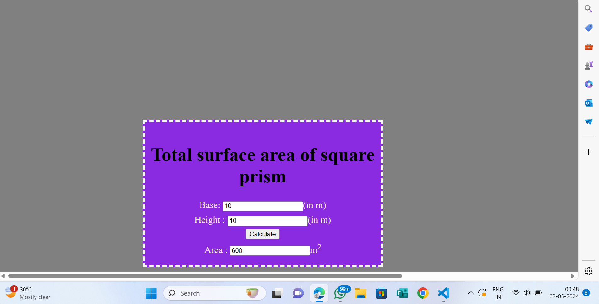

# Ex.05 Design a Website for Server Side Processing
## Date:02-04-2024

## AIM:
To design a website to find surface area of a Right Cylinder in server side.

## FORMULA:
Surface Area = 2Πrh + 2Πr<sup>2</sup>
<br>r --> Radius of Right Cylinder
<br>h --> Height of Right Cylinder

## DESIGN STEPS:

### Step 1:
Clone the repository from GitHub.

### Step 2:
Create Django Admin project.

### Step 3:
Create a New App under the Django Admin project.

### Step 4:
Create python programs for views and urls to perform server side processing.

### Step 5:
Create a HTML file to implement form based input and output.

### Step 6:
Publish the website in the given URL.

## PROGRAM :
```
math.html

<!-- saved from url=(0022)http://127.0.0.1:8000/ -->
<html><head><meta http-equiv="Content-Type" content="text/html; charset=UTF-8">

<meta http-equiv="X-UA-Compatible" content="IE=edge">
<title>Area of Rectangle</title>
<meta name="viewport" content="width=device-width, initial-scale=1">
<style type="text/css">
body 
{
background-color:grey;
}
.edge {
width: 1440px;
margin-left: auto;
margin-right: auto;
padding-top: 250px;
padding-left: 300px;
}
.box {
display:block;
border: Thick dashed whitesmoke;
width: 500px;
min-height: 300px;
font-size: 20px;
background-color:blueviolet;
}
.formelt{
color:blanchedalmond;
text-align: center;
margin-top: 7px;
margin-bottom: 6px;
}
h1
{
color:black;
text-align: center;
padding-top: 20px;
}

</style>
</head>
<body>
<div class="edge">
<div class="box">
<h1>Total surface area of square prism</h1>
<form method="POST">
<input type="hidden" name="csrfmiddlewaretoken" value="V8fM2nPZ3B6ocKkvvVbYUeHoP3cq77W0oQj5EX9U4HTKmJwWYAYrUQOXysA1HGbJ">
<div class="formelt">
Base: <input type="text" name="base" value="10">(in m)<br>
</div>
<div class="formelt">
Height : <input type="text" name="height" value="10">(in m)<br>
</div>
<div class="formelt">
<input type="submit" value="Calculate"><br>
</div>
<div class="formelt">
Area : <input type="text" name="area" value="600">m<sup>2</sup><br>
</div>
</form>
</div>
</div>


</body></html>

views.py

from django.shortcuts import render
def rectarea(request):
    context={}
    context['area'] = "0"
    context['a'] = "0"
    context['h'] = "0"
    if request.method == 'POST':
        print("POST method is used")
        a = request.POST.get('base','0')
        h = request.POST.get('height','0')
        print('request=',request)
        print('Base=',a)
        print('Height=',h)
        area = 2*int(a)*int(a) + 4*int(a)* int(h)
        context['area'] = area
        context['a'] = a
        context['h'] = h
        print('Area=',area)
    return render(request,'mathapp/math.html',context)
urls.py

from django.contrib import admin
from django.urls import path
from mathapp import views
urlpatterns = [
    path('admin/', admin.site.urls),
    path('areaofrectangle/',views.rectarea,name="areaofrectangle"),
    path('',views.rectarea,name="areaofrectangleroot")
]    

```


## SERVER SIDE PROCESSING:



## HOMEPAGE:



## RESULT:
The program for performing server side processing is completed successfully.
